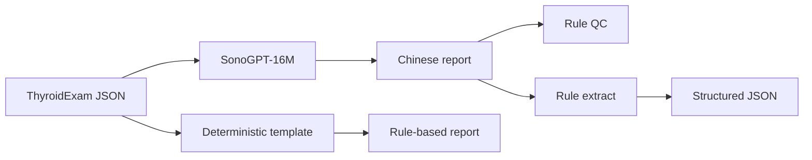

# SonoGPT

中文 | [English](./README_en.md)

从零实现的轻量 Decoder-only Transformer，把甲状腺单结节结构化所见转换成中文超声报告草稿。

面向学习与工程演示：**不是医疗器械，不能用于临床诊断、筛查或治疗决策。**

**在线体验：** [http://39.107.227.41/](http://39.107.227.41/)（浏览器打开即可；CPU 推理，生成一条报告可能要数秒。）

想按开发顺序学完整条链路（Schema → 数据 → Tokenizer → Transformer → 训练 → 评估 → 推理），从 [docs/from_zero_to_one.md](docs/from_zero_to_one.md) 开始。

## 做什么

医院报告系统通常需要两件事：把所见写成规范句子，以及把句子还原成可校验的结构。SonoGPT 把这两件事拆开：

| 方向 | 输入 | 输出 | 实现 |
| --- | --- | --- | --- |
| Generate | Schema v1 JSON | 中文报告 | 15M 参数 Transformer |
| Extract | 中文报告 | Schema v1 JSON | 规则基线（V1 未训练抽取模型） |
| QC | 报告 ± JSON | 一致性发现 | 版本化规则 |

神经网络只负责已训练的 generate。抽取、质控和确定性模板是独立对照系统，避免用模型自己抽自己的生成结果当唯一成绩。



当前范围固定为：中文、甲状腺、单个结节、所见描述。不包含超声图像、多结节关系、良恶性判断或 TI-RADS 评分。

## 模型

| | |
| --- | --- |
| 架构 | Decoder-only Transformer，Pre-LN，权重共享 Embedding |
| 规模 | 8 层 × 6 头，`d_model=384`，**15,003,648** 参数 |
| Tokenizer | SentencePiece BPE，1,807 pieces，byte fallback |
| 训练 | 5,000 step，有效 batch 32，RTX 2060 Laptop |
| 默认权重 | 验证 Loss 最佳的 `step_00004900.pt` |
| 数据 | 5,000 个合成语义病例；按病例切分，并留出未见过的报告语序 |

训练语料由语义病例生成器采样结构，再经多种模板家族渲染，而不是直接从字符串反推标签。同一语义病例不会同时出现在训练和测试中。

## 结果

数字来自冻结测试集，三套集合**分开报告，不混合平均**。字段指标由独立规则解析器计算。完整产物见 [`reports/`](reports/README.md)。

**Generate**（JSON → 报告，Checkpoint 4900）

| 测试集 | 样本 | 任一训练模板匹配 | 明示字段准确率 | 尺寸精确匹配 |
| --- | --- | --- | --- | --- |
| 已见模板语序 | 1,500 | 0.9960 | 0.9997 | 1.0000 |
| 留出模板语序 | 500 | 0.9960 | 0.9997 | 1.0000 |
| 模拟改写挑战集 | 30 | 0.9667 | 1.0000 | 0.9630 |

已见模板上的逐字匹配约为 33%：同一 JSON 对应三种合法语序，模型常写出其中另一种，语义仍对齐。留出语序 `flow_first_v2` 在生成中出现 0 次，但字段几乎全部正确——说明学到的是结构到内容的映射，而不是那一种未见句式。

挑战集为学习评估用的改写样本，**不是**真实人类或临床挑战集。

**规则基线**

- 抽取：夹具 / 已见 / 留出 / 挑战集上明示字段准确率均为 1.0，幻觉率 0
- 质控：干净样本 error 假阳性 0；11 类注入缺陷 recall 1.0

## 快速开始

需要 Python 3.12 和 [uv](https://docs.astral.sh/uv/)。

```powershell
git clone https://github.com/lds051332/SonoGPT.git
cd SonoGPT
uv sync --extra dev
uv run pytest
```

Windows / Linux 会安装 `torch 2.12.0+cu126`。无 NVIDIA 驱动时，规则抽取、质控和测试仍可在 CPU 上运行。

本仓库包含源码、Schema、冻结记录、评估报告和文档。Tokenizer、合成 JSONL 与 Checkpoint 体积较大，未纳入 Git。缺少权重时，规则模板和抽取仍可用；模型生成需要在本机放置：

```text
artifacts/tokenizers/sonogpt_bpe_1807_candidate_v2/
data/processed/synthetic_v1_5k_candidate_v2/
artifacts/training/sonogpt_16m_m3/step_00004900.pt
```

本地网页（Schema 表单，不是聊天框）：

```powershell
uv run python scripts/serve_demo.py --device cuda
```

打开 [http://127.0.0.1:8000/](http://127.0.0.1:8000/)。默认只监听本机。无 GPU 的 Linux 不要直接 `uv sync`（会安装 CUDA 版 PyTorch），按 [docs/deploy_cpu.md](docs/deploy_cpu.md) 安装 CPU 轮子并用 `--device cpu`。

命令行：

```powershell
uv run python scripts/infer.py generate --device cuda --json-file reports/inference/generate_smoke_input.json
uv run python scripts/infer.py extract --text "甲状腺右叶中部见一枚实性低回声结节，大小约8×6mm。"
uv run python scripts/infer.py qc --text-file report.txt --json-file exam.json
```

`generate` 在质控 error 时默认回退到确定性模板。`extract` 与 `qc` 不加载模型权重。

复现已发表的评估：

```powershell
uv run python scripts/evaluate_generate.py --device cuda
uv run python scripts/evaluate_extract_baseline.py
uv run python scripts/evaluate_qc_baseline.py
```

## 仓库结构

```text
src/sonogpt/
  schemas/      单结节 Schema v1
  data/         语义采样、模板渲染、切分与冻结
  model/        15M Decoder-only
  baselines/    确定性模板、规则抽取、质控
  evaluation/   指标、解析器、评估流水线
  inference/    CLI 引擎
  web/          本机 FastAPI Demo
scripts/        训练、评估、推理与 Demo 入口
docs/           评估、基线、推理、网页与 CPU 部署说明
reports/        可复核的评估与冒烟记录
data/releases/  数据与挑战集冻结记录
```

## 文档

| | |
| --- | --- |
| [docs/from_zero_to_one.md](docs/from_zero_to_one.md) | 从 0 到 1：大模型开发全流程学习手册 |
| [docs/evaluation.md](docs/evaluation.md) | 三套评估如何阅读，以及不应做的对照 |
| [docs/baselines.md](docs/baselines.md) | 模板、抽取与质控规则 |
| [docs/inference.md](docs/inference.md) | CLI 处理链 |
| [docs/web.md](docs/web.md) | 本地网页与 HTTP 接口 |
| [docs/deploy_cpu.md](docs/deploy_cpu.md) | 无 GPU 的 Linux 部署 |

## 局限

- 训练与测试数据为受约束的合成报告，不是真实病历
- V1 只训练 generate；开放句式上的抽取仍依赖规则
- 模型会收敛到训练见过的少数语序，不会发明临床新写法
- 质控中的结构一致性规则是工程约束，不是超声诊断标准

详细实现记录见 [IMPLEMENTATION_PROGRESS.md](IMPLEMENTATION_PROGRESS.md)。
