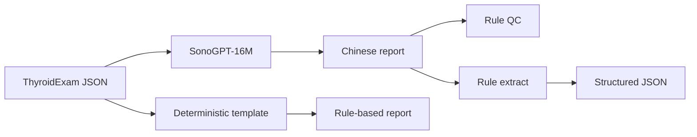

# SonoGPT

[中文](./README.md) | English

A from-scratch, lightweight decoder-only Transformer that turns structured findings for a single thyroid nodule into a Chinese ultrasound report draft.

Built for learning and engineering demonstration. **This is not a medical device and must not be used for clinical diagnosis, screening, or treatment decisions.**

A Chinese, stage-by-stage walkthrough of the full development loop (schema → data → tokenizer → Transformer → training → evaluation → inference) is in [docs/from_zero_to_one.md](docs/from_zero_to_one.md).

## What it does

Reporting systems typically need two directions: render findings as a controlled sentence, and recover a checkable structure from that sentence. SonoGPT splits them:

| Task | Input | Output | Implementation |
| --- | --- | --- | --- |
| Generate | Schema v1 JSON | Chinese report | 15M-parameter Transformer |
| Extract | Chinese report | Schema v1 JSON | Rule baseline (no extract model in V1) |
| QC | Report ± JSON | Consistency findings | Versioned rules |

The neural model is trained only for generate. Extraction, quality control, and the deterministic template are independent baselines, so the model is not scored by parsing its own output.



Scope is fixed: Chinese text, thyroid, one nodule, observational findings. No ultrasound images, multi-nodule relations, benign/malignant calls, or TI-RADS scores.

## Model

| | |
| --- | --- |
| Architecture | Decoder-only Transformer, Pre-LN, tied embeddings |
| Size | 8 layers × 6 heads, `d_model=384`, **15,003,648** parameters |
| Tokenizer | SentencePiece BPE, 1,807 pieces, byte fallback |
| Training | 5,000 steps, effective batch 32, RTX 2060 Laptop |
| Default weights | Best validation-loss checkpoint `step_00004900.pt` |
| Data | 5,000 synthetic semantic cases; split by case, with held-out report phrasing |

Training text is produced by sampling a semantic case first, then rendering it with several template families—not by deriving labels from surface strings. The same semantic case never appears in both train and test.

## Results

Figures come from frozen test sets. The three splits are **reported separately and never averaged**. Field metrics are computed by an independent rule parser. Full artifacts live in [`reports/`](reports/README.md).

**Generate** (JSON → report, checkpoint 4900)

| Test set | N | Any trained-template match | Mentioned-field accuracy | Exact dimension match |
| --- | --- | --- | --- | --- |
| Seen template order | 1,500 | 0.9960 | 0.9997 | 1.0000 |
| Held-out template order | 500 | 0.9960 | 0.9997 | 1.0000 |
| Simulated paraphrase challenge | 30 | 0.9667 | 1.0000 | 0.9630 |

Exact string match on seen templates is about 33%: one JSON maps to three valid word orders, and the model often emits another legal family while keeping the semantics aligned. The held-out family `flow_first_v2` appears 0 times in generation, yet fields are almost always correct—evidence that the model learned structure-to-content mapping, not that unseen phrasing.

The challenge set is rewritten text for a learning-demo evaluation. It is **not** a real human or clinical challenge set.

**Rule baselines**

- Extract: mentioned-field accuracy 1.0 and hallucination rate 0 on fixtures, seen, held-out, and challenge splits
- QC: 0 false-positive errors on clean samples; recall 1.0 on 11 injected defect types

## Quick start

Python 3.12 and [uv](https://docs.astral.sh/uv/) are required.

```powershell
git clone https://github.com/lds051332/SonoGPT.git
cd SonoGPT
uv sync --extra dev
uv run pytest
```

Windows / Linux installs `torch 2.12.0+cu126`. Without an NVIDIA driver, rule extraction, QC, and tests still run on CPU.

This repository includes source, schema, freeze records, evaluation reports, and docs. The tokenizer, synthetic JSONL, and checkpoints are large and are not stored in Git. Template rendering and extraction still work without weights; model generation needs `artifacts/` and `data/processed/` in the local layout.

Local web UI (a Schema form, not a chat box):

```powershell
uv run python scripts/serve_demo.py --device cuda
```

Open [http://127.0.0.1:8000/](http://127.0.0.1:8000/). The server binds to localhost by default. Use `--device cpu` if you have no GPU.

CLI:

```powershell
uv run python scripts/infer.py generate --device cuda --json-file reports/inference/generate_smoke_input.json
uv run python scripts/infer.py extract --text "甲状腺右叶中部见一枚实性低回声结节，大小约8×6mm。"
uv run python scripts/infer.py qc --text-file report.txt --json-file exam.json
```

`generate` falls back to the deterministic template on QC errors. `extract` and `qc` do not load model weights.

Reproduce the published evaluations:

```powershell
uv run python scripts/evaluate_generate.py --device cuda
uv run python scripts/evaluate_extract_baseline.py
uv run python scripts/evaluate_qc_baseline.py
```

## Layout

```text
src/sonogpt/
  schemas/      Single-nodule Schema v1
  data/         Semantic sampling, template rendering, splits, freeze
  model/        15M decoder-only Transformer
  baselines/    Deterministic template, rule extract, QC
  evaluation/   Metrics, parser, evaluation pipelines
  inference/    CLI engine
  web/          Local FastAPI demo
scripts/        Training, evaluation, inference, and demo entry points
docs/           Evaluation, baselines, inference, and web notes (Chinese)
reports/        Reviewable evaluation and smoke records
data/releases/  Data and challenge freeze records
```

## Documentation

Supplementary guides are currently in Chinese:

| | |
| --- | --- |
| [docs/from_zero_to_one.md](docs/from_zero_to_one.md) | From-zero-to-one learning guide (Chinese) |
| [docs/evaluation.md](docs/evaluation.md) | How to read the three evaluations, and comparisons to avoid |
| [docs/baselines.md](docs/baselines.md) | Template, extract, and QC rules |
| [docs/inference.md](docs/inference.md) | CLI pipeline |
| [docs/web.md](docs/web.md) | Local web UI and HTTP API |

## Limitations

- Train and test data are constrained synthetic reports, not real medical records
- V1 trains generate only; extraction on open phrasing still depends on rules
- The model converges to a few trained word orders and does not invent clinical style
- Structure-consistency QC is an engineering constraint, not an ultrasound diagnostic standard

A detailed implementation log is in [IMPLEMENTATION_PROGRESS.md](IMPLEMENTATION_PROGRESS.md) (Chinese).
